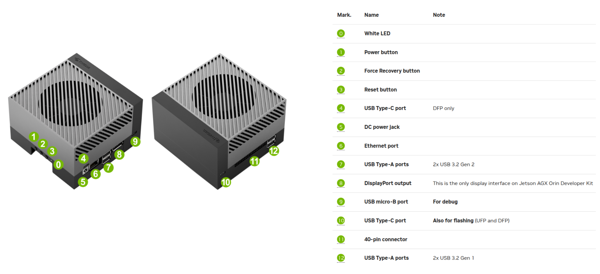
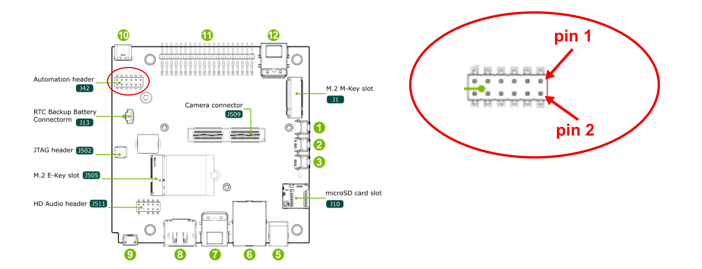
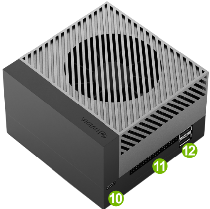
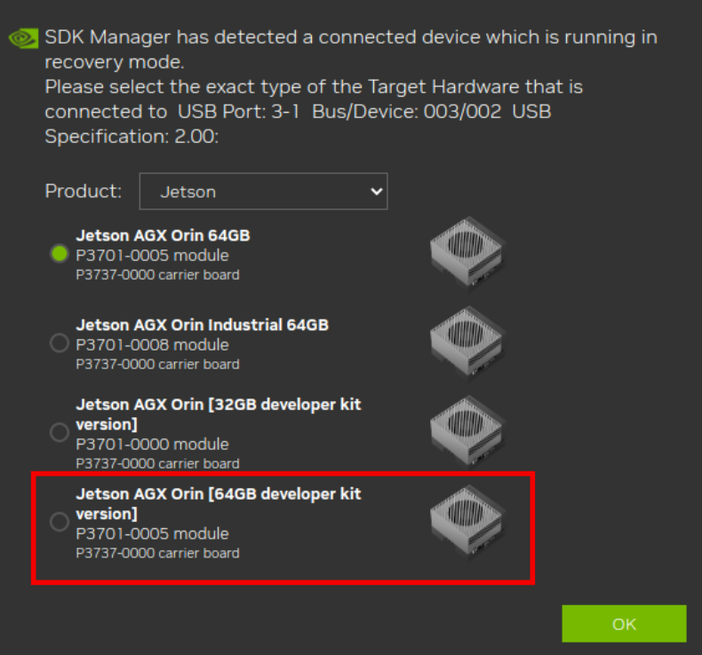
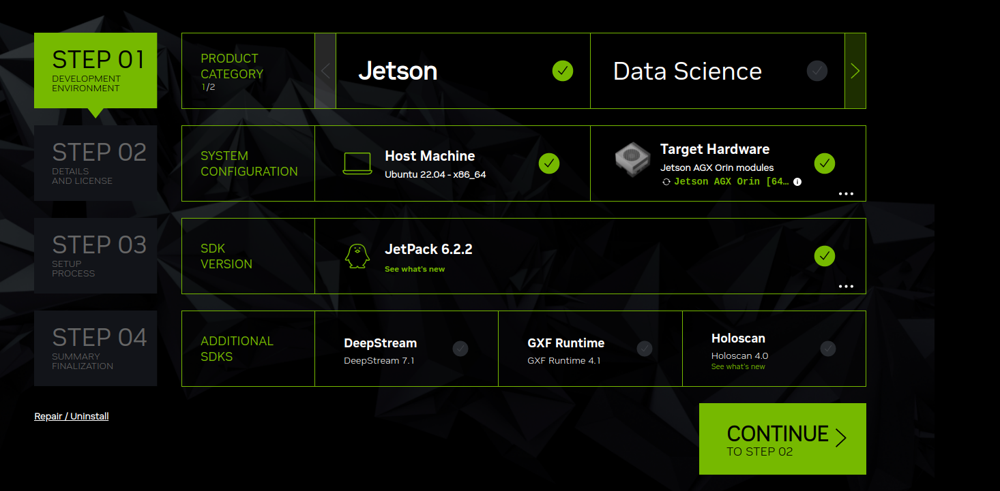
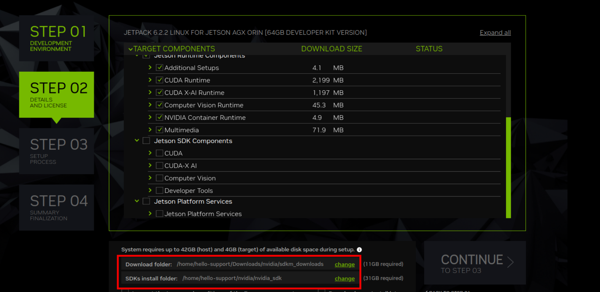
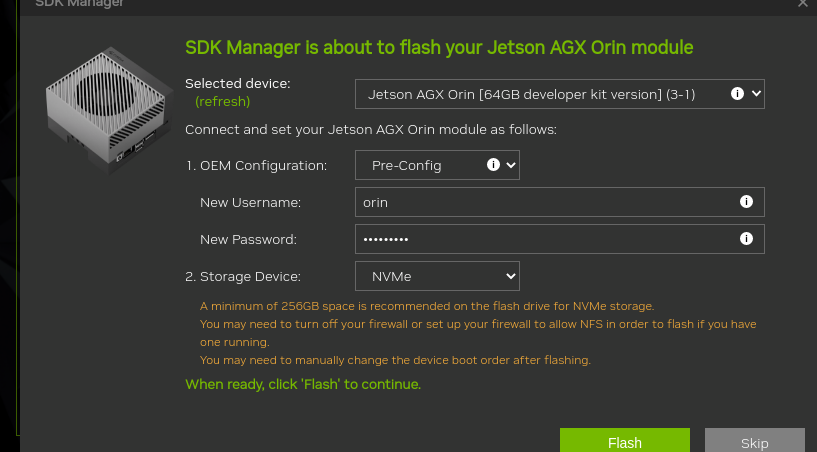

# Jetson AGX Orin: Definitive Flashing & Setup Guide

This guide provides a complete workflow for flashing a Jetson AGX Orin Developer Kit with a 512GB NVMe SSD using a host PC running Ubuntu 22.04.

<div align="center">
  
</div>

---

## 1. Requirements

- **Host OS**: Ubuntu 22.04 LTS  
  (Native installation recommended, avoid VM)

- **Power**:  
  Original USB-C power adapter 

- **Data Cable**:  
  USB-C to USB-C cable that supports **data transfer**, not charge-only

- **Hardware Jumper**:  
  1x Female-to-Female jumper wire (for Force Recovery Mode)

- **Storage**:  
  512GB NVMe SSD installed in the M.2 slot

---

## 2. Install NVIDIA SDK Manager (JetPack) on Ubuntu 22.04

Before flashing the Jetson, you need to install **NVIDIA SDK Manager**, which is used to download and flash **JetPack**.


### Step 1: Download SDK Manager

Go to the official NVIDIA page:  
https://developer.nvidia.com/nvidia-sdk-manager

Download the **Ubuntu 22.04 `.deb` package**.

> You may need to log in with an NVIDIA Developer account.

---

### Step 2: Install SDK Manager

Navigate to your Downloads folder and install:

```bash
cd ~/Downloads
sudo apt install ./sdkmanager_*.deb
```

### Step 3: Launch

```bash
sdkmanager
```

---
## 3. Enter Force Recovery Mode (Jumper Method)

> **Note**  
> Force Recovery Mode can also be entered using the physical buttons on the board  
> (see button layout — typically *Button 2* on the dev kit).  
>  
> In this guide, we use the **` Automation header (J42)` pins with a jumper wire**, which is more reliable for repeatable flashing.

---

### Step 1: Locate Pins

<div align="center">
  
</div>

Locate the `Automation header (J42)` along with the 2 pins:

- Pin 1: `GND (Ground)`
- Pin 2:  `FC REC (Force Recovery)`


---

### Step 2: Connect Jumper


Connect:
- `FC REC (Force Recovery)` (Pin 2)
to  
- `GND (Ground)` (Pin 1)

---

### Step 3: Connect USB-C to Host (Required)

> **Important**  
> The Jetson has **two USB-C ports**, but only one is used for flashing.  
>  
> Use the USB-C port labeled **10** in the diagram (front-facing port near the 40-pin header).  
>  
> The other USB-C port is **power-only** and will not work for flashing or device detection.


<div align="center">
  
</div>

Connect a **USB-C data cable** from:

- Jetson USB-C port (**label 10**)  → Host PC

> This connection is required for:
> - device detection (`lsusb`)
> - flashing via SDK Manager

--- 

### Step 4: Power On

Plug in power. The device will automatically enter **Recovery Mode**.

---

## 4. SDK Manager Configuration

### Step 01


- Select:
  - **Jetson AGX Orin (64GB Developer Kit)**

<div align="center">
  
</div>


You should now see this:

<div align="center">
  
</div>

**Note: Make sure Jetpack version is `JetPack 6.x`**

---

### Step 02
- Select appropriate folders for:

  - **`Download folder`**
  - **`SDKs install location`**

<div align="center">
  
</div>
---

### Step 03: Flash Settings


- **OEM Configuration**: Pre-Config
- **Set username and password**
- **Storage Device**: Change from `eMMC` → `NVMe`


- Click **Flash**

<div align="center">
  
</div>

---

## 5. Post-Flash SDK Installation

### Step 1: Remove Jumper
Once flashing reaches **100%**, remove the jumper wire immediately.

---

### Step 2: Reset Device
Press the **Reset button** on the Jetson.

---

### Step 3: Verify Connection

```bash
ping 192.168.55.1
```

---

### Step 4: Install SDK Components

After reboot, SDK Manager will automatically prompt for installation.

Select:
- **Connection**: `USB`
- Confirm device: Jetson AGX Orin Developer Kit

Enter the **username and password you configured during flashing**.

Click **Install**

---

## You are all set

Your Jetson AGX Orin should now be fully flashed and ready for development.
